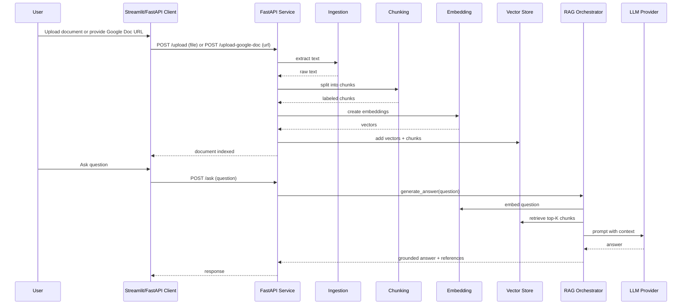
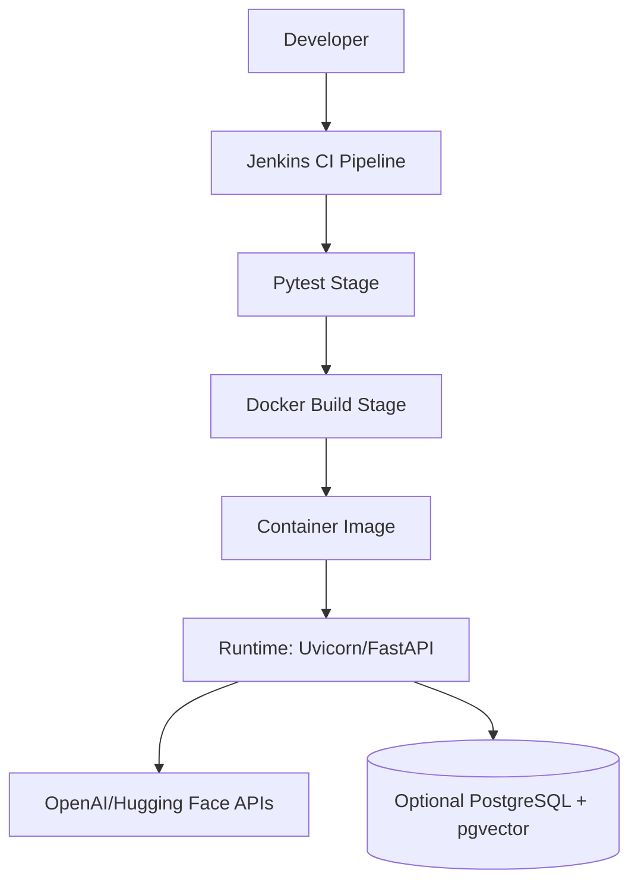
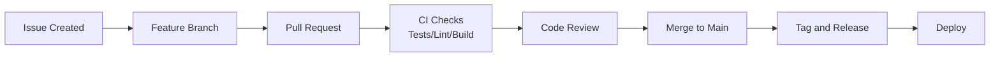

# Intelligent Document QA (RAG): End-to-End Architecture, Implementation, and Insights

Date: 2026-07-02  
Audience: Technical and non-technical readers

## Project Overview

### Objective

Build an AI application that allows users to upload documents (PDF, DOCX, TXT, images via OCR) and ingest shared Google Docs, ask questions in natural language, and receive answers grounded in indexed content.

### Business Value

- Reduces manual time spent reading long documents.
- Improves information accessibility for non-technical users.
- Provides traceable answers through section-based references.
- Supports both local demos and production-style deployment patterns.

### Scope

- Document ingestion and parsing.
- Text chunking and embedding generation.
- Vector similarity retrieval.
- LLM-based answer generation with guardrails.
- API interface and Streamlit UI.

## System Architecture

The system follows a modular Retrieval-Augmented Generation (RAG) architecture.

```mermaid
flowchart LR
    U[User] --> UI[Streamlit UI]
    U --> API[FastAPI]

    UI --> API
    API --> ING[Ingestion Layer]
    ING --> CH[Chunking Layer]
    CH --> EMB[Embedding Layer]
    EMB --> VS[Vector Store Layer\nFAISS | pgvector | Hybrid]

    API --> RAG[RAG Orchestrator]
    RAG --> VS
    RAG --> LLM[LLM Provider\nOpenAI | Hugging Face | Auto]
    LLM --> RAG
    RAG --> API
    API --> UI
```

### Architecture in Plain Terms

The architecture can be understood as two connected loops:

- Ingestion loop: turn uploaded documents into searchable vectors.
- Question-answering loop: turn a user question into a grounded answer using retrieved context.

This separation is intentional. It allows document processing and question answering to evolve independently without tightly coupling code.

### Layered Architecture View

| Layer | Main Components | Responsibility | Typical Output |
|---|---|---|---|
| Presentation Layer | Streamlit UI, API consumers | File upload, question submission, result display | HTTP requests and user-visible responses |
| Service Layer | FastAPI endpoints, request schemas | Input validation, endpoint orchestration, lifecycle hooks | Indexed document state, answer payload |
| AI Orchestration Layer | RAG orchestrator, prompt builder, provider router | Retrieval, prompt assembly, LLM invocation, guardrails | Grounded answer with references |
| Retrieval Layer | VectorStore abstraction, FAISS/pgvector/hybrid | Similarity search and top-K context selection | Ranked context chunks |
| ML Layer | SentenceTransformer embedding model | Convert text/questions into vectors | Dense embeddings |
| Data Processing Layer | Ingestion + chunking modules | Parse files, normalize text, chunk + label sections | Labeled chunks |
| Infrastructure Layer | Docker, Jenkins, optional PostgreSQL | Runtime packaging, CI, persistent vector storage | Deployable service artifact |

### Core Components and Responsibilities

1. API Gateway and Orchestration
- FastAPI endpoint handlers coordinate upload and ask workflows.
- Pydantic schemas define and validate request/response contracts.

2. Ingestion Engine
- Detects file type and extracts text from PDF, DOCX, TXT, and image formats.
- Handles common decoding and parsing edge cases.
- Supports Google Docs URL ingestion by exporting shared docs as plain text.

3. Chunking Engine
- Splits long text into overlap-preserving chunks.
- Adds section labels to support traceable citations in final answers.

4. Embedding Engine
- Uses all-MiniLM-L6-v2 to produce 384-dimensional vectors.
- Uses lazy loading with thread-safe initialization to avoid repeated model startup cost.

5. Vector Retrieval Engine
- Supports FAISS for low-latency local memory search.
- Supports pgvector for persistent SQL-backed vector search.
- Supports hybrid mode for mirrored writes and configurable primary retrieval path.

6. RAG and LLM Orchestrator
- Retrieves top-K chunks for a question.
- Builds context-bounded prompt.
- Routes inference to OpenAI, Hugging Face, or auto provider mode.
- Applies grounding and relevance checks before returning response.

### Runtime Modes

| Mode | How It Runs | Best For | Trade-off |
|---|---|---|---|
| In-process demo | Streamlit + local pipeline directly | Fast local experimentation | Less representative of production API behavior |
| API-backed UI | Streamlit calling FastAPI endpoints | Integration testing and team demos | Depends on running API service |
| Service-only | FastAPI behind container/runtime | Deployment and automation | Requires external UI/client |

### Data and State Lifecycle

1. Upload arrives at the service.
2. File is written to temporary storage.
3. Text is extracted and chunked.
4. Chunks are embedded and written to selected vector backend.
5. Temporary upload file is deleted.
6. User question is embedded and searched against stored vectors.
7. Retrieved context is passed into the prompt.
8. LLM output is validated and normalized before response.

State note:

- Current implementation keeps an active index in service memory for the latest uploaded document in demo-style operation.
- Persistent retrieval is available via pgvector backend for durability across runs.

### Reliability and Fallback Design

- If no document is indexed, the API returns a safe informational answer.
- If retrieved context is irrelevant, the system returns a standardized no-relevant-information response.
- If provider calls fail, a fallback response path still returns a context-derived output when possible.
- Deduplication reduces repeated context and improves answer clarity.

### Scalability Considerations

Current strengths:

- Modular boundaries make it straightforward to swap storage and provider implementations.
- Backend abstraction allows transition from in-memory to persistent vector retrieval.

Current limits:

- Module-level active index state is convenient for demos but not ideal for multi-user concurrency.
- Heuristic groundedness checks are effective but may need reranking for larger and noisier corpora.

Recommended architecture evolution:

1. Add document-id or tenant-id scoped indexing.
2. Move retrieval to persistent backend as default for shared deployments.
3. Add queue-based ingestion for large files.
4. Add observability for latency, retrieval quality, and provider errors.

### Architectural Design Principles

- Separation of concerns: each pipeline stage is isolated in its own module.
- Pluggability: backend and provider selection is configuration-driven.
- Defensive AI output handling: relevance and groundedness checks are built in.
- Progressive scalability: FAISS for local speed; pgvector for persistence.

## Technology Stack

| Layer | Technologies | Purpose |
|---|---|---|
| Frontend | Streamlit | Document upload, Q&A interaction, session-based history |
| Backend API | FastAPI, Uvicorn, Pydantic | REST endpoints, validation, service runtime |
| Database / Vector Store | FAISS (in-memory), PostgreSQL + pgvector (persistent) | Similarity search over embeddings |
| AI / ML Frameworks | sentence-transformers, OpenAI SDK, Hugging Face Inference API | Embeddings + LLM answer generation |
| Data Processing | pdfplumber, python-docx, NumPy | Text extraction and vector handling |
| Multimodal Ingestion | Pillow, pytesseract, requests | OCR extraction and Google Docs fetch |
| DevOps | Docker, Jenkins, pytest | Containerization, CI pipeline, testing |
| Third-party Integrations | OpenAI API, Hugging Face API | External inference services |
| Cloud Services | Optional (provider-hosted APIs for LLMs) | Managed model inference |

Notes:

- No mandatory cloud platform dependency (AWS/Azure/GCP) is required to run the app.
- Cloud usage is optional through model provider APIs.

## Application Workflow



## Database Design

The app supports two retrieval modes:

1. FAISS in-memory index (default for local/demo speed).
2. PostgreSQL with pgvector (persistent storage and multi-run durability).

### pgvector Table Design

| Column | Type | Description |
|---|---|---|
| id | BIGSERIAL PK | Unique embedding row identifier |
| text | TEXT | Original chunk text |
| embedding | vector(384) | Dense vector from all-MiniLM-L6-v2 |
| source_document | TEXT | Optional source filename/document id |
| metadata | JSONB | Arbitrary metadata |
| created_at | TIMESTAMPTZ | Insertion timestamp |

### Indexes

- HNSW vector index on embedding for nearest-neighbor search.
- B-tree index on source_document for filtering/useful lookups.

## API Overview

| Endpoint | Method | Input | Output | Purpose |
|---|---|---|---|---|
| /upload | POST (multipart) | file (pdf/docx/txt/images) | {"message": "Document processed successfully"} | Build retrieval index from uploaded file |
| /upload-google-doc | POST (JSON) | {"google_doc_url": "..."} | {"message": "Document processed successfully"} | Build retrieval index from shared Google Docs content |
| /ask | POST (JSON) | {"question": "..."} | {"answer": "..."} | Return answer grounded in indexed content |

### Request and Response Schemas

```python
class QuestionRequest(BaseModel):
    question: str

class AnswerResponse(BaseModel):
    answer: str
```

- QuestionRequest input: natural-language user question.
- AnswerResponse output: generated answer text (optionally with references).

## Key Functions and Code Explanations

This section uses focused snippets (not full source files) and explains each snippet in plain language.

### 1) API Upload Handler

```python
@app.post("/upload")
async def upload_document(file: UploadFile = File(...)):
    file_path = f"temp_{file.filename}"
    with open(file_path, "wb") as f:
        shutil.copyfileobj(file.file, f)

    text = extract_text(file_path)
    chunks = chunk_text(text)
    embeddings = embed_text(chunks)

    global vector_store
    vector_store = VectorStore(dim=len(embeddings[0]))
    vector_store.clear()
    vector_store.add(embeddings, chunks)

    os.remove(file_path)
    return {"message": "Document processed successfully"}
```

Purpose:

- Converts an uploaded file into a searchable vector index.

How it works:

- Saves the file temporarily, extracts text, splits text into chunks, embeds chunks, and stores vectors in the configured backend.

Inputs:

- Multipart file upload (PDF, DOCX, TXT, image files).

Outputs:

- Success message indicating indexing completed.

Dependencies:

- extraction module, chunking module, embeddings module, vector store module.

Interaction with other components:

- Produces the index state consumed later by the /ask endpoint.

### 2) Text Chunking with Section Labels

```python
def chunk_text(text: str) -> list[str]:
    if CHUNK_OVERLAP >= CHUNK_SIZE:
        raise ValueError("CHUNK_OVERLAP must be less than CHUNK_SIZE")

    chunks = []
    start = 0
    while start < len(text):
        end = start + CHUNK_SIZE
        chunk = text[start:end].strip()
        if chunk:
            label = _infer_section_label(chunk, len(chunks))
            chunks.append(f"[{label}] {chunk}")
        start = end - CHUNK_OVERLAP
    return chunks
```

Purpose:

- Splits long text into overlapping segments that preserve context and can be retrieved efficiently.

How it works:

- Uses fixed-size windows with overlap to avoid losing meaning at boundaries.
- Prefixes each chunk with a readable section label for traceable references.

Inputs:

- Raw extracted text.

Outputs:

- List of labeled chunks ready for embedding.

Dependencies:

- Configuration constants (CHUNK_SIZE, CHUNK_OVERLAP), section label helper.

Interaction with other components:

- Output feeds directly into embedding generation and later citation formatting.

### 3) Thread-safe Embedding Model Loader

```python
_model = None
_model_lock = threading.Lock()

def get_model():
    global _model
    if _model is not None:
        return _model

    with _model_lock:
        if _model is None:
            from sentence_transformers import SentenceTransformer
            _model = SentenceTransformer("all-MiniLM-L6-v2")
    return _model
```

Purpose:

- Ensures the embedding model is initialized once and reused safely across requests.

How it works:

- Uses lazy loading and a lock to prevent concurrent duplicate model initialization.

Inputs:

- None directly (uses configured model name).

Outputs:

- Reusable SentenceTransformer instance.

Dependencies:

- sentence-transformers library and Python threading.

Interaction with other components:

- Called by embed_text for both document chunks and user questions.

### 4) Vector Backend Selection Wrapper

```python
class VectorStore:
    def __init__(self, dim: int, backend: str | None = None):
        self.backend = (backend or config.VECTOR_DB_BACKEND).lower()
        if self.backend == "faiss":
            self._store = FaissVectorStore(dim)
        elif self.backend == "pgvector":
            self._store = PGVectorStore(dim)
        elif self.backend == "hybrid":
            self._store = HybridVectorStore([FaissVectorStore(dim), PGVectorStore(dim)])
        else:
            raise ValueError("Unsupported VECTOR_DB_BACKEND")
```

Purpose:

- Provides a single interface for multiple retrieval backends.

How it works:

- Reads runtime configuration and instantiates the selected backend strategy.

Inputs:

- Embedding dimension and optional backend override.

Outputs:

- Backend-specific store hidden behind a unified API.

Dependencies:

- FAISS implementation, pgvector implementation, hybrid strategy.

Interaction with other components:

- Called by upload flow to index data; queried by RAG flow during question answering.

### 5) RAG Orchestrator with Guardrails

```python
def generate_answer(question, vector_store):
    query_embedding = embed_text([question])[0]
    context_chunks = _dedupe_chunks(vector_store.search(query_embedding, config.TOP_K))

    if not _has_relevant_context(question, context_chunks):
        return NO_RELEVANT_INFO_RESPONSE

    prompt = build_prompt(context_chunks, question)
    raw_answer = call_provider(prompt)
    return _finalize_answer(raw_answer, question, context_chunks)
```

Purpose:

- Orchestrates retrieval, prompt construction, LLM inference, and answer safety checks.

How it works:

- Embeds question, retrieves top-K chunks, validates relevance, queries model provider, validates groundedness, appends references.

Inputs:

- User question and active vector store.

Outputs:

- Final answer text, either grounded response or standardized no-relevant-info message.

Dependencies:

- embeddings helper, vector store, provider clients (OpenAI/Hugging Face), heuristic validators.

Interaction with other components:

- Invoked by /ask endpoint and returns user-facing answer content.

## Role of Prompt Engineering

Prompt engineering is central to correctness and safety in this app.

### Prompt Design Strategy

- Force context-bounded answering.
- Explicitly disallow external knowledge unless marked as external.
- Require fallback response when context does not support the question.
- Require references when section labels exist.

### Prompt Template Pattern

```text
Answer the question using ONLY the context below.
If unsupported, return exactly: "I couldn't find relevant information..."
Do not use outside knowledge.
Context:
{retrieved_context}

Question:
{question}
```

### Context Management

- Top-K retrieval limits prompt length and focuses signal.
- Chunk overlap preserves semantic continuity.
- Deduplication removes repeated chunks before prompt assembly.

### Prompt Optimization Techniques Used

- Deterministic generation (temperature = 0 for OpenAI path).
- Reference instructions to improve source traceability.
- Guardrail post-processing to reject ungrounded outputs.

### Contribution to Performance and Accuracy

- Better grounding improves factual alignment.
- Context constraints reduce hallucination risk.
- Structured references improve user trust and verification.

## LLM Integration

### Model Selection

- OpenAI model (default): low-latency general-purpose generation.
- Hugging Face inference model: alternative provider pathway.
- Auto mode: race both providers and use first successful response.

### Inference Flow

1. Convert question to embedding.
2. Retrieve top-K similar chunks.
3. Build grounded prompt.
4. Call provider.
5. Validate and normalize answer.

### Embeddings

- Model: all-MiniLM-L6-v2.
- Vector dimension used by pgvector schema: 384.
- Embeddings generated for both document chunks and user queries.

### Vector Database Usage

- FAISS for in-memory retrieval.
- pgvector for persistence and SQL-native vector search.
- Hybrid mode for mirrored writes and configurable primary search.

### Retrieval Strategy

- Similarity search for candidate chunks.
- Deduplication of repeated retrievals.
- Heuristic relevance and groundedness validation before returning response.

### AI Orchestration

- Centralized in a single generate_answer workflow.
- Includes provider fallback and graceful degradation behavior.

## Security Considerations

### Secret Management

- API keys are loaded from environment variables or .env for local use.
- Keys are not hard-coded in source.

### Input and File Safety

- Uploads are restricted by supported file type handling logic.
- Files are stored temporarily and deleted after ingestion.

### Data Protection

- In-memory mode minimizes persistence risk.
- pgvector mode enables controlled persistence with DB-level policies.

### SQL and Injection Safety

- Identifier sanitization is applied for dynamic table names.
- Parameterized SQL is used for vector queries/inserts.

### AI Safety Controls

- Context-only response instructions.
- Irrelevance and groundedness checks.
- Standardized fallback for unsupported answers.

## Testing Strategy

### Test Types

- Unit tests for ingestion, vector store helpers, and RAG logic.
- API tests for /upload and /ask endpoint behavior.
- Behavior tests for grounding and fallback rules.

### Testing Approach

- Monkeypatching external dependencies to keep tests deterministic.
- Stubbing provider calls for fast and isolated validation.
- Coverage of edge cases: unsupported files, duplicate chunks, irrelevant context.

### Quality Outcomes

- Faster CI runs with fewer flaky network-dependent failures.
- Confidence in both happy path and safety path behavior.

## Deployment Architecture



### Deployment Components

- Dockerfile packages app and dependencies.
- Jenkinsfile automates setup, test, and optional image build.
- Runtime can be local, VM, or container platform.

### Operational Notes

- For production, prefer persistent backend and externalized configuration.
- Add centralized logging/metrics for retrieval and latency observability.

## Future Enhancements

1. Multi-user document isolation (document IDs and tenant-aware retrieval).
2. Persistent metadata model with source attribution at chunk granularity.
3. Retrieval reranking (cross-encoder) to improve answer relevance.
4. Expanded API response schema (sources, confidence, latency, provider).
5. Observability dashboards for top-K quality, rejection reasons, and drift.
6. Security hardening (rate limits, authn/authz, file scanning).
7. Human-in-the-loop feedback loop for answer quality improvement.

## Summary

This project is a strong implementation of a modular RAG system that balances usability, extensibility, and safety. It combines a clear API/UI experience with configurable retrieval infrastructure and practical AI guardrails. The design is suitable for education, internal knowledge assistants, and as a baseline for production-grade document intelligence platforms.

Implemented in [app/rag.py](app/rag.py): in-memory response and retrieval caches now short-circuit repeated questions and repeated retrieval patterns while staying tied to the current vector-store revision.
Implemented in [docker-compose.yml](docker-compose.yml) and [Dockerfile](Dockerfile): API worker counts are environment-driven, and retrieval/inference can run as separate services behind shared persistent storage.
Implemented in [app/main.py](app/main.py), [app/rag.py](app/rag.py), and [app/retrieval_service.py](app/retrieval_service.py): multi-document knowledge spaces now use `collection_id` so several documents can be grouped and queried together at folder/project level.
Implemented in [app/schemas.py](app/schemas.py), [app/main.py](app/main.py), [app/rag.py](app/rag.py), and [app/retrieval_service.py](app/retrieval_service.py): advanced retrieval filters now support `document_date`, `author`, `tag`, and `source_system`.
Implemented in [app/schemas.py](app/schemas.py), [app/main.py](app/main.py), and [app/feedback_store.py](app/feedback_store.py): human feedback capture now supports thumbs up/down and correction-loop entries with a summary endpoint for continuous quality analysis.
Implemented in [app/ingestion.py](app/ingestion.py), [app/main.py](app/main.py), [app/schemas.py](app/schemas.py), and [app/streamlit_demo.py](app/streamlit_demo.py): multimodal ingestion now supports image OCR and shared Google Docs URL indexing.

## Recommendations: 

### 1) Performance and Scalability

1. Move from single active in-memory index to multi-tenant persistent indexing. >>Implemented 
2. Use asynchronous ingestion jobs with a task queue (for example Celery/RQ + Redis) to process large files without blocking API requests.>>Implemented 
3. Add response caching for repeated questions and frequent retrieval patterns.>>Implemented
4. Introduce retrieval reranking (cross-encoder or LLM reranker) to improve top-K relevance quality.>>Implemented
5. Add horizontal scaling for API workers and isolate inference/retrieval workloads into separate services.>>Implemented
6. Track and optimize key SLO metrics: p95 latency, retrieval hit quality, error rate, and throughput.>>Implemented

### 2) Enterprise-Level Architecture Upgrades

1. Add identity and access management (SSO, OAuth2/OIDC, RBAC).
2. Implement tenant isolation at document, index, and query levels.
3. Add audit trails for uploads, queries, responses, and admin operations.
4. Adopt secrets management (Vault or cloud secret manager) instead of local .env for production.
5. Add policy controls for data residency, retention, and deletion workflows.
6. Introduce governance workflows for model/prompt/version approvals.

### 3) Feature Expansion Roadmap

1. Multi-document collections with folder/project-level knowledge spaces. >> Implemented
2. Rich citation output with chunk id, page number, and confidence signals.
3. Advanced retrieval filters (date, author, tag, source system).>>Implemented 
4. Conversation memory with configurable session context windows.
5. Agent-like workflows for multi-step tasks (summarize, compare, extract actions, draft responses).
6. Human feedback capture (thumbs up/down, correction loop) for continuous quality improvement.>>Implemented

### 4) Integration and Platform Expansion Components

1. Enterprise connectors: SharePoint, Confluence, Google Drive, OneDrive, Jira, Slack, email archives. (Google Docs URL import implemented as first connector step.)
2. Event-driven ingestion pipelines from file stores and content management systems.
3. Webhooks and SDKs for embedding into internal portals and line-of-business apps.
4. BI and observability integration: Prometheus/Grafana, OpenTelemetry, SIEM feeds.
5. Optional model gateway for switching across providers and on-prem models.

### 5) Security and Reliability Hardening

1. Add malware scanning and content safety checks during upload.
2. Enforce API rate limits, quotas, and abuse detection.
3. Encrypt data in transit and at rest, including vector storage.
4. Add backup/restore and disaster recovery runbooks.
5. Add chaos/load testing to validate failover and capacity under peak demand.

### 6) Suggested Delivery Phases

1. Phase 1 (0-2 months): observability, caching, rate limiting, persistent default backend.
2. Phase 2 (2-4 months): SSO/RBAC, tenant isolation, async ingestion queue, connectors.
3. Phase 3 (4-6 months): reranking, governance, feedback loops, advanced analytics and cost controls.

Expected outcomes:

- Faster response times and improved query quality.
- Stronger enterprise trust through governance, security, and auditability.
- Better adoption by integrating with existing enterprise systems and workflows.

## Role of GitHub in the Development Process

GitHub plays a central role in how this app is designed, built, reviewed, tested, and maintained over time.

### 1) Source Control and Project History

- GitHub repositories store all application code, documentation, scripts, and configuration.
- Branching keeps experimental work isolated from stable branches.
- Commit history provides traceability for architecture and feature decisions.

### 2) Team Collaboration and Workflow

- Developers work in feature branches and open pull requests (PRs) for changes.
- PR reviews enable peer validation of code quality, correctness, and maintainability.
- Review discussions capture rationale for design choices and trade-offs.

### 3) Quality Gates and CI Integration

- GitHub events (push/PR) can trigger CI pipelines (for example Jenkins) to run tests and checks.
- Required checks enforce quality before merging into main branches.
- This creates a consistent "test before merge" process that reduces regressions.

### 4) Documentation and Knowledge Sharing

- Markdown docs in the repository evolve with the codebase.
- Architecture, deployment, and test guidance remain versioned and reviewable.
- This supports onboarding and reduces reliance on undocumented tribal knowledge.

### 5) Release and Change Management

- Tags and release notes can mark stable milestones.
- GitHub Issues and Projects help plan roadmap items and prioritize fixes.
- Linked PRs/issues provide end-to-end traceability from requirement to implementation.

### 6) Security and Governance Enablement

- Branch protections help enforce review and status checks.
- Secrets should never be committed; repository policies and scanning workflows help prevent leaks.
- Auditability from commits/PRs supports governance and enterprise compliance expectations.

### Recommended GitHub Workflow for This App

1. Create issue with scope and acceptance criteria.
2. Implement on feature branch.
3. Open PR with tests and documentation updates.
4. Run CI checks and address review comments.
5. Merge after approvals and passing checks.
6. Tag release and publish release notes for deployment.



## Author

Getinet Aga, Software Engineer/ Project Manager at GForce LLC