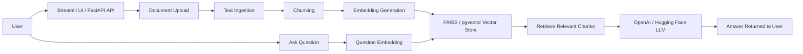

# Technology Used

This project is a **Retrieval-Augmented Generation (RAG) Document Question Answering System** built with Python and a mix of web, AI, storage, and DevOps tools.

## Project Summary

The application allows users to **upload documents** such as PDF, DOCX, and TXT files, convert them into **vector embeddings**, store them in a searchable vector database, and then ask **natural-language questions** about the uploaded content.

It supports:
- a **FastAPI backend** for API-based interaction
- a **Streamlit frontend** for local user interaction
- **FAISS** or **pgvector/PostgreSQL** for vector search
- **OpenAI** or **Hugging Face** for answer generation
- **python-pptx** for automated capstone presentation generation

## App Visualization

## Core Stack

| Technology | Purpose |
|---|---|
| **Python 3** | Main programming language for the application and tests |
| **FastAPI** | Backend API for document upload and question answering endpoints |
| **Uvicorn** | ASGI server used to run the FastAPI app |
| **Streamlit** | Simple web UI for interacting with the RAG system locally |
| **Pydantic** | Request/response data validation and schema handling |

## AI / RAG Technologies

| Technology | Purpose |
|---|---|
| **SentenceTransformers** | Generates embeddings for document chunks and questions |
| **FAISS** | In-memory vector similarity search |
| **pgvector** | PostgreSQL vector extension for persistent embedding search |
| **PostgreSQL / psycopg** | Database layer for the optional persistent vector backend |
| **OpenAI API** | LLM provider for answer generation |
| **Hugging Face Inference API** | Alternative LLM provider |

## Document Processing

| Technology | Purpose |
|---|---|
| **pdfplumber** | Extracts text from PDF files |
| **python-docx** | Reads text from DOCX files |
| **NumPy** | Numerical operations for embedding/vector handling |
| **Requests** | HTTP calls to external model APIs |
| **python-multipart** | Supports file uploads through FastAPI |
| **python-pptx** | Programmatic creation and update of PPTX presentation files |

## Testing and Quality

| Technology | Purpose |
|---|---|
| **pytest** | Unit and integration testing |
| **fastapi.testclient** | API endpoint testing |
| **pytest monkeypatch** | Isolation of heavy/model/network operations during tests |

## DevOps and Tooling

| Technology | Purpose |
|---|---|
| **Docker** | Containerizing the application |
| **Jenkins** | CI pipeline for install, test, and build workflows |
| **GitHub Actions** | Docker image CI workflow for branch and PR validation |
| **Mermaid** | Architecture and pipeline diagrams in project docs |
| **Git / GitHub** | Version control and remote collaboration |

## Summary

The project combines:
- **Backend API development** with FastAPI
- **Interactive UI** with Streamlit
- **RAG and vector search** using SentenceTransformers, FAISS, and pgvector
- **Optional LLM integration** through OpenAI or Hugging Face
- **Testing and CI/CD** using pytest, Docker, Jenkins, and GitHub Actions
- **Presentation automation** using python-pptx
