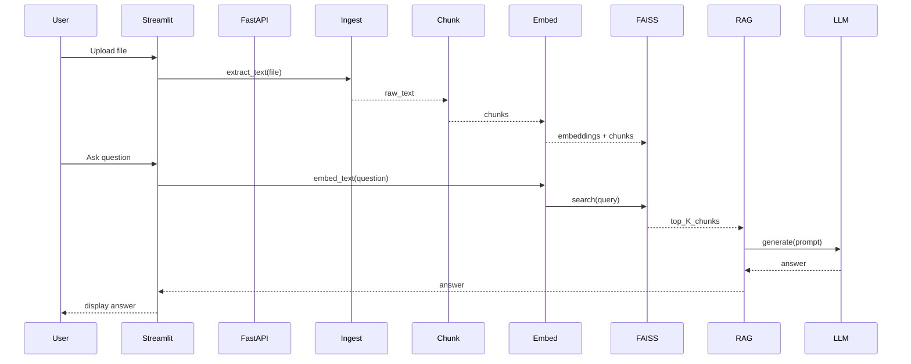

# Application Architecture

This document describes the architecture of the RAG Document QA example
application, its main components, data flow, and deployment considerations.

## High-level Overview

The application implements a small Retrieval-Augmented Generation (RAG)
pipeline that allows users to upload documents and ask natural-language
questions about their content. The primary responsibilities are:

- Ingest documents and extract text (PDF, DOCX, TXT).
- Chunk documents into retrievable pieces.
- Produce embeddings for chunks and store them in a vector index.
- Retrieve relevant chunks given a user question and generate an answer
  using an LLM provider (OpenAI or Hugging Face).

Key runtime options:
- In-process demo (Streamlit) for local experiments. 
- FastAPI server for programmatic access (endpoints: `/upload`, `/ask`).
- Pluggable LLM provider via environment configuration (`LLM_PROVIDER`).

## Components

- `app/main.py` — FastAPI app exposing endpoints to upload documents and
  ask questions. Maintains a module-scoped `VectorStore` for the demo.
- `app/ingestion.py` — Extracts text from PDF/DOCX/TXT files.
- `app/chunking.py` — Splits large text into overlapping chunks.
- `app/embeddings.py` — Lazily loads a SentenceTransformers model and
  computes dense embeddings for chunks.
- `app/vector_store.py` — Minimal FAISS-backed in-memory store that holds
  vectors and their corresponding text chunks.
- `app/rag.py` — Orchestrates retrieval and calls an LLM provider to
  produce an answer. Supports OpenAI Responses API and Hugging Face
  Inference API.
- `app/streamlit_demo.py` — UI to run the pipeline locally in-process.
- `streamlit_app.py` — API-backed Streamlit UI that talks to `/upload`
  and `/ask` using callback-driven event handlers.
- `app/config.py` — Lightweight `.env` loader and central configuration
  (models, provider, chunk sizes, top-K retrieval).

## Data Flow

1. User uploads a document via `/upload` (FastAPI) or the Streamlit UI.
2. `ingestion.extract_text` extracts raw text from the file.
3. `chunking.chunk_text` splits the text into chunks with overlap.
4. `embeddings.embed_text` encodes chunks into dense vectors.
5. `vector_store.add` inserts vectors + chunks into a FAISS index.
6. On `/ask`, the service embeds the question and performs a
   nearest-neighbor search (`vector_store.search`) to retrieve top-K
   chunks.
7. `rag.generate_answer` constructs a prompt containing only the
   retrieved context and delegates to the configured LLM backend to
   produce a grounded answer.

## Frontend Event Handling

The Streamlit UIs use explicit widget callbacks rather than relying only
on inline conditional branches during reruns.

- File uploader `on_change` handlers reset document-specific session
  state when the selected file changes, which prevents stale answers from
  being shown for a previous upload.
- Button and form callbacks trigger document processing and question
  submission as discrete events before the next render pass.
- Clear-history callbacks remove prior Q&A state without affecting the
  current backend configuration.

This event-driven approach makes the UI behavior more predictable during
Streamlit reruns and keeps the frontend aligned with the backend's
single-document indexing model.

## Sequence Diagram (Mermaid)



The FastAPI-backed frontend flow is similar but uses HTTP callbacks:
User -> Streamlit event handler -> FastAPI `/upload` or `/ask`. The
backend then runs the same pipeline steps and stores the index in memory
for the demo.

## Diagrams

- Mermaid sources (editable): [docs/diagrams/architecture.mmd](docs/diagrams/architecture.mmd)
- Mermaid pipeline source: [docs/diagrams/pipeline.mmd](docs/diagrams/pipeline.mmd)

To render SVG/PNG assets locally, install the Mermaid CLI and run the
generator script included in the repo:

```bash
npm install -g @mermaid-js/mermaid-cli
./scripts/generate_mermaid.sh
```

Windows PowerShell:

```powershell
npm install -g @mermaid-js/mermaid-cli
.\scripts\generate_mermaid.ps1
```

Generated assets will be placed in `docs/assets/diagrams`.

## Deployment

- The repository contains a `Dockerfile` to build a container image.
- `Jenkinsfile` demonstrates a cross-platform CI pipeline that runs
  tests and conditionally builds the Docker image.
- For production, consider:
  - Persistent vector stores (e.g., Milvus, Pinecone, Weaviate) instead
    of in-memory FAISS.
  - Sharding or approximate indexing for large datasets (IVF, HNSW).
  - Secure secret management (Vault, cloud KMS) rather than `.env` files.

## Security & Secrets

- The app reads `OPENAI_API_KEY` and `HUGGINGFACE_API_KEY` from the
  environment (or `.env` during local development). Never commit secrets.
- Network clients are used securely; avoid global TLS overrides.

## Extensibility

- Swap the embedding provider (local SentenceTransformers → OpenAI
  embeddings) by updating `embeddings.py` and `config.py`.
- Add metadata and provenance by extending the `VectorStore` to store
  document IDs, chunk offsets, and retrieval scores.
- Implement a persistent `VectorStore` backed by a database or cloud
  vector DB to support multiple concurrent users and larger corpora.

## Files to Review

- `app/main.py`, `app/rag.py`, `app/ingestion.py`, `app/embeddings.py`,
  `app/vector_store.py`, `app/streamlit_demo.py`, `streamlit_app.py`,
  `Jenkinsfile`, `Dockerfile`.

---

If you want, I can also add a PNG/SVG diagram generated from the
Mermaid source and place it under `docs/assets/` and update the README
to reference it — would you like that? 
