# Technology Used

This project is a **Retrieval-Augmented Generation (RAG) Document Question Answering System** built with Python and a mix of web, AI, storage, and DevOps tools.

## Project Summary

The application ingests content from several sources — direct uploads (PDF, DOCX, TXT, image OCR), shared Google Docs, SharePoint / OneDrive-for-Business files (via Microsoft Graph), and the rows of a read-only SQL query (PostgreSQL or SQLite) — converts it into **vector embeddings**, stores them in a searchable vector database, and answers **natural-language questions** grounded in that content.

It supports:
- a **FastAPI backend** exposing ingestion (`/upload`, `/upload-google-doc`, `/upload-sharepoint`, `/ingest-database`), querying (`/ask`, `/question-domains`), async-job status (`/ingestion-jobs/{id}`), and observability (`/metrics`, `/feedback`, `/feedback/summary`)
- two **Streamlit** front ends — `streamlit_app.py` (talks to the API) and `app/streamlit_demo.py` (runs the pipeline in-process) — plus `app/metrics_dashboard.py` for retrieval-metric visualization
- **FAISS** (in-memory default), **pgvector / PostgreSQL** (persistent), or **hybrid** (mirror-write) vector backends behind one wrapper
- **OpenAI**, **Hugging Face**, or **auto** (races both) for answer generation
- an optional **service split** — `app.retrieval_service` (:8001) and `app.inference_service` (:8002) — for horizontal scaling over a shared persistent index
- **python-pptx** for automated capstone presentation generation

## App Visualization

```mermaid
flowchart LR
    U[User] --> UI[Streamlit UI / FastAPI API]
    UI --> SRC[Uploads / Google Docs / SharePoint / SQL rows]
    SRC --> I[Text Extraction]
    I --> C[Chunking + section labels]
    C --> E[Embedding Generation]
    E --> VS[FAISS / pgvector / hybrid Vector Store]

    U --> Q[Ask Question]
    Q --> QE[Question Embedding]
    QE --> VS
    VS --> RC[Retrieve candidate pool]
    RC --> RR[Lexical rerank + relevance gate]
    RR --> LLM[OpenAI / Hugging Face / auto]
    LLM --> GG[Grounding gates + References]
    GG --> A[Answer + question_domain]
```

Large uploads are queued to an in-process background worker (`app/ingestion_jobs.py`); retrieval and generation can be delegated to standalone services when `RETRIEVAL_SERVICE_URL` / `INFERENCE_SERVICE_URL` are set.

## Core Stack

| Technology | Purpose |
|---|---|
| **Python 3** | Main programming language for the application and tests |
| **FastAPI** | Backend API for document upload and question answering endpoints |
| **Uvicorn** | ASGI server used to run the FastAPI app |
| **Streamlit** | Simple web UI for interacting with the RAG system locally |
| **Pydantic** | Request/response data validation and schema handling |

## AI / RAG Technologies

| Technology | Purpose |
|---|---|
| **SentenceTransformers** (`all-MiniLM-L6-v2`, 384-dim) | Generates embeddings for document chunks and questions |
| **FAISS** | In-memory vector similarity search (default backend) |
| **pgvector** | PostgreSQL vector extension for persistent embedding search |
| **PostgreSQL / psycopg** | Persistent (`pgvector`) and `hybrid` vector backends; source for `/ingest-database` |
| **OpenAI Responses API** | Primary LLM provider (`LLM_PROVIDER=openai`) |
| **Hugging Face Inference API** | Alternative LLM provider (`huggingface`); `auto` races both and takes the first non-empty reply |

### RAG behavior implemented in `app/rag.py`

- Retrieves a candidate pool (`RETRIEVAL_RERANK_POOL_SIZE`), lexically reranks it, keeps `TOP_K`.
- A lexical relevance gate skips the LLM call entirely when the question and context share too few terms.
- Grounding gates (`_is_answer_grounded`, `_answer_addresses_question`) downgrade an unsupported answer to a fixed "no relevant information" response.
- Appends a `References:` line from the `[Section N]` labels added during chunking.
- In-memory response and retrieval caches (30-minute TTL), keyed partly on the vector store's `revision` counter.
- A heuristic classifier tags every answer with a `question_domain` from a 20-entry catalog (`GET /question-domains`).

## Content Ingestion and Processing

| Technology | Purpose |
|---|---|
| **pdfplumber** | Extracts text from PDF files |
| **python-docx** | Reads text from DOCX files |
| **Pillow + pytesseract** | OCR for image uploads (PNG/JPG/TIFF/…); needs a system Tesseract install |
| **Requests** | Google Docs export fetch; Microsoft Graph token + SharePoint file download; Hugging Face Inference API |
| **psycopg / stdlib `sqlite3`** | Read-only SQL row ingestion for `/ingest-database` (no new dependency) |
| **NumPy** | Numerical operations for embedding/vector handling |
| **python-multipart** | Supports file uploads through FastAPI |
| **python-pptx** | Programmatic creation and update of PPTX presentation files |

### Ingestion source → module

| Source | Endpoint | Module |
|---|---|---|
| Upload (PDF/DOCX/TXT/image OCR) | `POST /upload` | `app/ingestion.py` (`extract_text`) |
| Google Docs URL | `POST /upload-google-doc` | `app/ingestion.py` (`extract_google_doc_text`) |
| SharePoint / OneDrive file | `POST /upload-sharepoint` | `app/ingestion.py` (`extract_sharepoint_text`, Microsoft Graph app-only token) |
| SQL database rows | `POST /ingest-database` | `app/db_ingestion.py` (`extract_database_text`, read-only `SELECT`) |

## Observability

| Component | Purpose |
|---|---|
| `app/slo_metrics.py` | Structured SLO report at `GET /metrics`: p50/p90/p95/p99 latency distribution, availability, throughput, retrieval-hit quality, plus per-target attainment, error budget, and a `healthy`/`at_risk`/`breached` status (targets via `SLO_*` env vars) |
| `app/feedback_store.py` | Thumbs up/down plus free-text corrections, at `POST /feedback` and `GET /feedback/summary` |
| `app/metrics_dashboard.py` | Streamlit Precision@K / Recall@K dashboard with a CI-style quality gate (currently synthetic sample data) |

## Testing and Quality

| Technology | Purpose |
|---|---|
| **pytest** | Unit and integration testing (76 tests across 7 files) |
| **fastapi.testclient** | API endpoint testing |
| **pytest monkeypatch** | Isolation of heavy/model/network operations during tests |
| **black / isort / flake8 / mypy** | Formatting and static checks (`requirements-dev.txt`; not yet enforced in CI) |

## DevOps and Tooling

| Technology | Purpose |
|---|---|
| **Docker** | Containerizing the application (`Dockerfile`, worker count via `API_WORKERS`) |
| **Docker Compose** | `docker-compose.yml` runs the 3-service split (api :8000, retrieval :8001, inference :8002) |
| **Jenkins** | Declarative CI pipeline for setup, test, and optional Docker build (`Jenkinsfile`) |
| **Mermaid** | Architecture and pipeline diagrams in project docs |
| **Git / GitHub** | Version control and remote collaboration |

## Summary

The project combines:
- **Backend API development** with FastAPI — four ingestion endpoints, a query endpoint, and observability endpoints
- **Interactive UIs** with Streamlit (API-backed and in-process) plus a metrics dashboard
- **Multi-source ingestion** — uploads, Google Docs, SharePoint (Microsoft Graph), and read-only SQL rows — all funnelling into one chunk → embed → index path with shared tenant/collection/document scoping
- **RAG and vector search** using SentenceTransformers with FAISS / pgvector / hybrid backends, lexical reranking, relevance and grounding gates, and answer caching
- **Optional LLM integration** through OpenAI, Hugging Face, or `auto`
- **Optional service split** for scaling retrieval and inference independently
- **Testing and CI/CD** using pytest (76 tests), Docker, Docker Compose, and Jenkins
- **Presentation automation** using python-pptx
